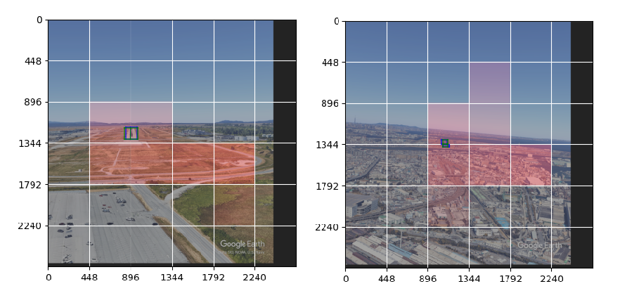

# JoliNeedle: Compute Efficient, Gaze Based Object Detector

**JoliNeedle** is an experimental software that uses novel techniques to detect
small objects in big images in a compute-efficient way.

JoliNeedle introduces a decision model in the detection process to select which
parts of the image are worth spending detection time. The goal is to avoid running
an high-end, expensive detector on pixels that do not contain the target object.

This repository contains code to train the decision and detection models jointly
on object detection tasks. The current implementation divides the image into patches
and train the decision model to navigate towards patches containing useful information.



## Installation

First install common dependencies:

```sh
pip install -r requirements.txt
```

Then you have to install the YOLOX repo by hand:

```sh
git clone https://github.com/pierrot-lc/YOLOX.git
cd YOLOX
pip3 install -v -e .
```

<!-- TODO? ### Docker Installation -->

## Training a Model

### Datasets

Jolineedle takes datasets as a .txt list of files with each line stating the absolute path of the image file and of the bbox file. The bbox file format is a list of bounding boxes with each line corresponding to a box in the format `class_id xmin ymin xmax ymax` (coordinates are in pixels).

As an example you can try to run JoliNeedle on the [LARD dataset](https://github.com/deel-ai/LARD). To get and prepare the dataset you can refer to [these instructions](docs/lard_dataset.md).

### Metrics visualization

JoliNeedle uses [Visdom](https://github.com/fossasia/visdom) to display metrics.
Start the visdom server using following command:

```sh
visdom
```

### Supervised

In the "supervised" training pipeline, the model learns to predict the next action on generated trajectories. We assume that the best action is always to take the shortest path (a straight line) to the target.

Here is the command line to train a detector using supervised pipeline:

```sh
python3 main.py\
    --group exp\
    --env-name lard_gpt_nano\
    --dataset-dir "${DATASET_PATH}"\
    --work-dir "${CHECKPOINTS_DIR}"\
    --seed 12345 \
    --port-ddp 12357\
    --devices 0\
    --training-mode supervised\
    --patch-size 448\
    --max-seq-len 8\
    --batch-size 4\
    --gradient-accumulation 8\
    --max-iters 20000\
    --test-every 500\
    --generated-sample-eval-size 100\
    --test-samples 100\
    --num-workers 1\
    --lr 0.0001\
    --yolo-lr 0.0001\
    --model-type gpt-nano\
    --gpt-backbone yolox-nano\
    --concat-embeddings\
    --decoder-pos-encoding\
    --use-positional-embedding\
    --image-processor yolox-s\
    --detector-conf-threshold 0.50\
    --augment-translate\
    --loss on-optimal-trajectory\
    --dropout 0.0\
    --binomial-keypoints\
    --max-keypoints 3\
    --min-keypoints 0
```

You can use `python3 main.py --help` to have a list of all arguments along with their
explanations.

### Reinforcement learning

In the "reinforce" training pipeline, the model explores the image by itself and is trained using the REINFORCE algorithm. The model receives a reward that is proportional to the number of visited patches containing a bounding box.

Here is the command line to train a detector using the reinforcement learning pipeline
```sh
python3 main.py\
    --seed 12345 \
    --port-ddp 12357\
    --dataset-dir "${DATASET_PATH}"\
    --work-dir "${CHECKPOINTS_DIR}"\
    --training-mode reinforce\
    --max-iters 200000\
    --test-every 1\
    --test-samples 100\
    --env-name my_rl_env\
    --group my_group\
    --model-type gpt-nano\
    --gpt-backbone yolox-nano\
    --image-processor yolox-s\
    --use-positional-embedding\
    --concat-embeddings\
    --decoder-pos-encoding\
    --binomial-keypoints\
    --max-seq-len 20\
    --batch-size 1\
    --gradient-accumulation 24\
    --min-keypoints 0\
    --max-keypoints 3\
    --dropout 0.0\
    --entropy-weight 0.01\
    --num-workers 1\
    --patch-size 448\
    --enable-stop\
    --lr 0.0001\
    --devices 0\
    --augment-translate
```

## Tests

Tests can be executed using following command:

```sh
bash scripts/run_tests.sh
```

As they rely on pytest, you can use any pytest arguments, for example to select a test:
```sh
bash scripts/run_tests.sh -k rl
```
